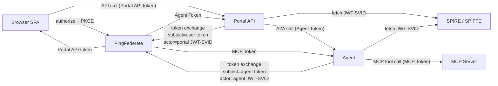

# SPIFFE Token Exchange Chatbot Demo

This repository contains a deterministic chatbot demo that shows OAuth token exchange with SPIFFE workload identity. The chatbot behavior is intentionally simple. The important behavior is the identity chain across the browser, portal, agent, MCP server, PingFederate, and SPIRE.

For guidance about cluster setup, PingFederate configuration, Kubernetes manifests, deployment commands, and scripts, see [docs/configuration.md](docs/configuration.md).

## Components

- `src/backend/services/portal`: Python web portal API. It serves the browser UI from `src/frontend`, validates the browser OAuth token, exposes `/api/me` and `/api/chat`, and exchanges the user token before calling the agent.
- `src/backend/services/agent`: Python customer-support agent. It validates the portal-issued agent token, chooses MCP tools through simple heuristics, exchanges the inbound token before calling MCP, and formats the final response.
- `src/backend/services/mcp_server`: Python MCP Streamable HTTP server using the official MCP Python SDK. It validates the agent-issued MCP token and enforces tool scopes for profile and payment data.
- `src/backend`: shared auth, config, HTTP, protocol, logging, scope, and SPIFFE token-exchange helpers.

## Architecture
The browser uses Authorization Code + PKCE with PingFederate. After that, the server-side path uses token exchange with SPIFFE JWT-SVID actor tokens.



The main components are:

- Browser SPA: signs the user in with PingFederate and calls the portal API.
- Portal API: validates the browser token, exchanges it for an agent token, and forwards the user request to the agent.
- Agent: validates the agent token, chooses MCP tools, exchanges the token again for the MCP audience, and calls the MCP server.
- MCP server: validates the MCP token and enforces tool scopes before returning customer data.
- PingFederate: issues browser, agent, and MCP access tokens, and validates the SPIFFE JWT-SVID actor token during token exchange.
- SPIRE: issues JWT-SVIDs to Kubernetes workloads through the SPIFFE Workload API.

## Expected Flow

A normal support request follows this path:

1. The user signs in through the Browser SPA.
2. PingFederate issues a Portal API token to the Browser SPA.
3. The Browser SPA calls `POST /api/chat` on the Portal API with the Portal API token.
4. The Portal API validates the Portal API token.
5. The Portal API fetches a portal JWT-SVID from SPIRE / SPIFFE.
6. The Portal API sends a token exchange request to PingFederate with the Portal API token as the subject token and the portal JWT-SVID as the actor token.
7. PingFederate issues an Agent Token to the Portal API.
8. The Portal API calls `POST /a2a/message` on the Agent with the Agent Token.
9. The Agent validates the Agent Token and chooses MCP tools.
10. The Agent fetches an agent JWT-SVID from SPIRE / SPIFFE.
11. The Agent sends a token exchange request to PingFederate with the Agent Token as the subject token and the agent JWT-SVID as the actor token.
12. PingFederate issues an MCP Token to the Agent.
13. The Agent calls the MCP Server with the MCP Token.
14. The MCP Server validates audience and scopes before returning profile or payment data.

## Token Exchange Shape

The portal-to-agent and agent-to-MCP exchanges both send the incoming PingFederate access token as the subject token and the caller workload JWT-SVID as the actor token:

```text
grant_type=urn:ietf:params:oauth:grant-type:token-exchange
subject_token=<incoming PingFederate OAuth access token>
subject_token_type=urn:ietf:params:oauth:token-type:access_token
actor_token=<caller workload JWT-SVID>
actor_token_type=urn:ietf:params:oauth:token-type:jwt
scope=<target API scopes>
resource=<target API resource>
client_id=<token-exchange-client-id>
```

PingFederate issues all OAuth access tokens. SPIRE only issues the JWT-SVID actor credential. PingFederate must trust the SPIRE JWT issuer and authorize the portal and agent SPIFFE identities as token-exchange actors.

## Workload Identities

The Kubernetes manifest defines `ClusterSPIFFEID` resources for these service-account identities:

```text
spiffe://<trust-domain>/ns/spiffe-token-exchange-demo/sa/portal
spiffe://<trust-domain>/ns/spiffe-token-exchange-demo/sa/agent
spiffe://<trust-domain>/ns/spiffe-token-exchange-demo/sa/mcp
```

The portal and agent mount the SPIFFE CSI Workload API socket at `/spiffe-workload-api`. The Python services fetch JWT-SVIDs through the SPIFFE Python library for the configured PingFederate audience and send them to PingFederate as `actor_token`.

## MCP Tools And Scopes

| MCP tool | Purpose | Required inbound MCP scope |
| --- | --- | --- |
| `get_customer_profile` | Customer plan, services, devices, status, usage | `customer:profile:read` |
| `get_payment_summary` | Balance, due date, autopay, last payment, recent invoices | `customer:payments:read` |

## Example Prompts

| Prompt | Tools | Behavior |
| --- | --- | --- |
| `what is my current plan?` | `get_customer_profile` | Returns plan, account status, loyalty tier, cycle end, and usage. |
| `how much data have I used?` | `get_customer_profile` | Returns mobile and home data usage. |
| `what are my devices?` | `get_customer_profile` | Returns registered router/SIM devices and status. |
| `show my bills` | `get_payment_summary` | Returns balance, due date, autopay, last payment, and recent bills directly. |
| `what is my latest bill?` | `get_payment_summary` | Returns the same payment summary data directly. |

## Replacing The Deterministic Agent

The external agent interface is `/a2a/message`. Internally, the agent uses deterministic heuristics in `src/backend/services/agent/llm.py`. If `OPENAI_API_KEY` is configured, the agent uses OpenAI for final response wording after MCP tool execution; otherwise it uses the mock formatter.

To plug in a real LLM later:

1. Keep `/a2a/message` stable.
2. Replace or expand the OpenAI call in `llm.py`.
3. Keep MCP execution in the agent runtime, not in the model.
4. Continue validating PingFederate access tokens and exchanging tokens outside the LLM.
